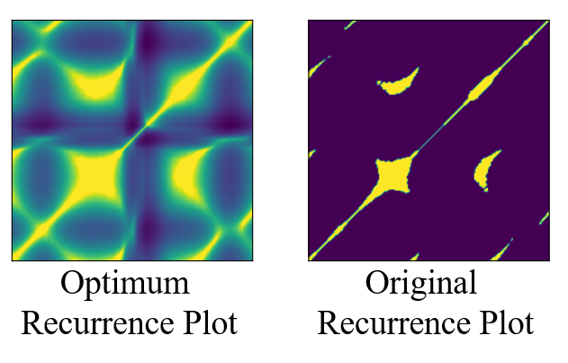

# OptRP: A Novel and Optimized Recurrence Plot
This work is part of the publication "OptRPC: A novel and optimized recurrence plot-based system for ECG beat classification" DOI: https://doi.org/10.1016/j.bspc.2021.103328

For any signal , we reconstruct its phase space using the Takens Embedding theorem in the following way.
 

Now, We define a new and optimized Recurrence Plot (RP)

\epsilon&space;\\&C=\frac{1}{\max&space;(D)}&space;\\&a=-\frac{\theta}{\ln&space;\left(c&space;x_{i&space;n}\right)}\end{aligned}" title="\begin{aligned}&\Theta_{o p t}(x ; \epsilon)=-a \ln (c x) ; \forall x>\epsilon \\&C=\frac{1}{\max (D)} \\&a=-\frac{\theta}{\ln \left(c x_{i n}\right)}\end{aligned}" />

where the thresholding parameter  is optimized. Lets assume there is a random variable  which explains the probabilistic nature of the recurrence plot 

